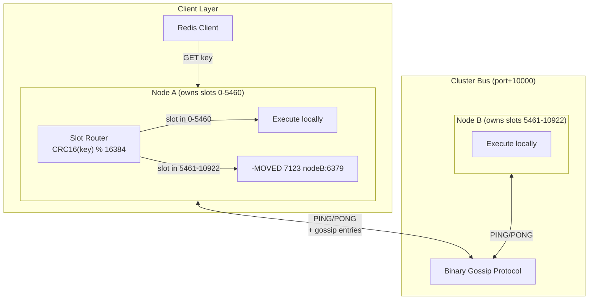

# Redis Cluster Protocol (Phase 2)

Hyperion implements a master-only subset of the Redis Cluster protocol, supporting dynamic hash slot distribution, live gossip-based node discovery, and MOVED redirection for clients. The implementation is intentionally partial: replicas, failover, and `CLUSTER SLOTS` are not implemented yet.

## Architecture

## Hash Slots and Internal Sharding

Like Redis, Hyperion divides the keyspace into 16,384 hash slots using `CRC16(key) % 16384`.

Because Hyperion is a multi-threaded server using a **share-nothing** architecture, the hash slot is further divided across the internal Workers.

`Internal Worker ID = (CRC16(key) % 16384) % NumWorkers`

This ensures that all keys belonging to a specific hash slot are always processed by the exact same internal thread, maintaining thread safety without locks.

## Gossip Protocol

Each Hyperion cluster node listens on a secondary port (default: client port + 10000) for binary cluster bus messages.

Every 1 second, the `GossipEngine`:
1. Randomly selects a subset of nodes (N/10).
2. Sends a binary `PING` message containing its own state (slots, epoch, flags) and a list of randomly selected gossip entries about other nodes.
3. The receiver updates its cluster state and replies with a `PONG`.

## Supported Cluster Commands

- `CLUSTER INFO` - Returns cluster state, slot assignment stats, and epoch.
- `CLUSTER NODES` - Returns the full node table in Redis-compatible format.
- `CLUSTER MYID` - Returns the node's unique 40-character ID.
- `CLUSTER DELSLOTS <slot> [slot ...]` - Removes slots currently assigned to this node.
- `CLUSTER MEET <ip> <port>` - Initiates a handshake to join a new node into the cluster.
- `CLUSTER ADDSLOTS <slot> [slot ...]` - Assigns specific hash slots to the node.
- `CLUSTER KEYSLOT <key>` - Returns the CRC16 hash slot for a key (supports `{hash tags}`).
- `CLUSTER SETSLOT <slot> <IMPORTING|MIGRATING|STABLE|NODE> [node-id]` - Changes the state of a hash slot for live migration.
- `CLUSTER GETKEYSINSLOT <slot> <count>` - Returns keys found in the specified slot by routing directly to the Worker that owns the slot.
- `CLUSTER COUNTKEYSINSLOT <slot>` - Returns the number of keys mapping to the specified slot by routing directly to the Worker that owns the slot.
- `MIGRATE <host> <port> <key> <db> <timeout>` - Transfers string keys by sending a RESP `SET`/`SET PX` command to the destination and deleting the local key after success.
- `ASKING` - Instructs the server to serve the next query even if it is not the authoritative owner of the slot (used during migrations).

`CLUSTER SLOTS` currently returns an explicit "not implemented" error. `GETKEYSINSLOT` and `COUNTKEYSINSLOT` enumerate the local string keyspace in the owning Worker; unlike normal `KEYS`, they do not perform lazy expiry during the scan, so active expiry may need to run before an elapsed-TTL key disappears from those introspection commands.

## Live Slot Migration

Hyperion has the basic primitives for live slot migration, but it does not yet fully match Redis's migration behavior.

1. **Source Node:** `CLUSTER SETSLOT <slot> MIGRATING <dest-node-id>`
2. **Dest Node:** `CLUSTER SETSLOT <slot> IMPORTING <src-node-id>`
3. **Execution:** Keys are pulled via `CLUSTER GETKEYSINSLOT` and pushed via `MIGRATE`.
4. **Finalization:** Both nodes are sent `CLUSTER SETSLOT <slot> NODE <dest-node-id>`.

During migration, `ASKING` is tracked on the connection and lets an importing destination serve the next command. The source side does not currently check whether a missing key has already moved, so it does not yet emit Redis-compatible `-ASK` redirects for that missing-key case.

## State Persistence

Cluster state (Node ID, configuration epochs, known nodes, and slot ownership) is persisted atomically to a `nodes.conf` file. Upon startup, Hyperion detects the `nodes.conf` file and natively rehydrates the cluster topology, bypassing the need for ZooKeeper or other external consensus mechanisms. Changes to the cluster topology (like `ADDSLOTS` or `SETSLOT`) trigger automatic atomic writes (`.tmp` → OS-level `rename`) ensuring crash-proof consistency.

## Failure Detection

Hyperion's cluster features a robust, two-phase distributed failure detection mechanism over the binary gossip bus:
1. **PFAIL (Probable Fail):** A node marks another node as `PFAIL` locally if it doesn't receive a `PONG` within the `ClusterNodeTimeout`.
2. **FAIL (Cluster Consensus):** Nodes share `PFAIL` flags via gossip `PING` packets. Once a node sees that the majority of cluster masters have flagged a node as `PFAIL` within a time window, the failure is promoted to `FAIL` and a broadcast is emitted across the cluster.

---

## Architectural Trade-offs & Self-Learning Notes

1. **MIGRATE Command (Internal RESP vs Binary Serializer)**
   - *Implementation:* When `MIGRATE` is executed, Hyperion encodes string keys dynamically into standard RESP `SET` or `SET PX` network commands, pushing them over a temporary TCP socket to the destination.
   - *Trade-off:* We sacrifice a tiny bit of CPU efficiency (due to RESP string-formatting) compared to a proprietary binary stream transfer.
   - *Learning:* This drastically simplified the implementation and lets the destination re-use the exact same `StringCommands.Set` logic it uses for normal clients. Complex value types still need a proper serialized transfer format before migration can be considered complete.
2. **Lock-Free GETKEYSINSLOT Routing**
   - *Implementation:* Unlike single-threaded Redis, Hyperion is multi-threaded. Finding keys in a slot could theoretically require taking a read-lock across all `Worker` thread shards. Instead, `CLUSTER GETKEYSINSLOT` is intercepted within the `HyperionServer` dispatcher and forcefully routed to the *exact* Worker thread that mathematically owns that CRC16 slot.
   - *Trade-off:* Requires intercepting commands at the parsing layer, tightly coupling `HyperionServer` to some cluster protocol commands.
   - *Learning:* Strict adherence to the "Share-Nothing" architecture pays off. By routing mathematically, we achieve lock-free shard iteration without halting throughput on other cores.
3. **Pipelined ASKING Execution**
   - *Implementation:* The `ASKING` flag is tracked as `_askingNext` locally inside the `IOHandler` event loop. It attaches specifically to the immediate next `WorkerTask` via a boolean property.
   - *Trade-off:* We lose the ability to easily query the "global connection state" deep inside the command engine.
   - *Learning:* Tracking connection-level state inside an async multi-threaded pipeline is notoriously difficult and race-condition prone. Pushing the flag down transactionally into the execution engine ensures `CommandExecutor` remains stateless and thread-safe.
4. **CROSSSLOT Hardening**
   - *Implementation:* Multi-key operations (`DEL` and future `MGET`/`MSET`) must enforce that all keys resolve to the exact same CRC16 hash slot in Cluster Mode.
   - *Learning:* A multi-key command bypasses standard split-scatter-gather routing when `ClusterProvider` is enabled, deferring to the inner `CommandExecutor` which sequentially runs `Crc16.Compute` against all trailing arguments. If any mismatch occurs, it throws a `-CROSSSLOT` error, enforcing the strict Redis Cluster contract.
